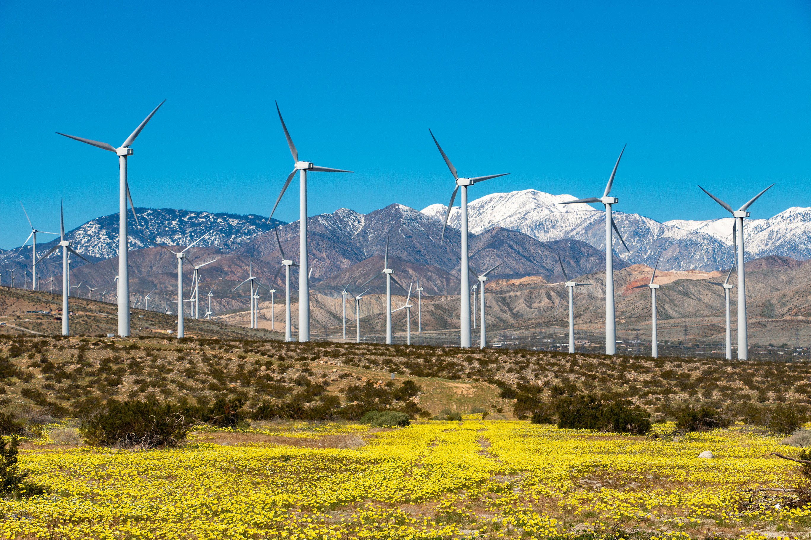
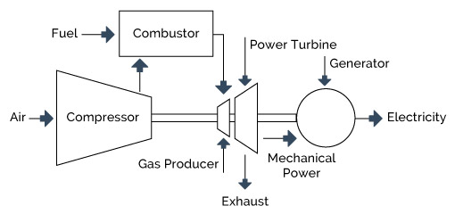

## Overview
The function of a turbine is to convert the kinetic energy of a fluid flow into mechanical or electrical energy that we can use. As fluid moves past the blades of the turbine, it exerts a force which causes a rotation along the central shaft. The rotation of this shaft generates usable energy. Turbines can be found in different contexts, including but not limited to wind turbines and dams to generate electricity, aircraft engines to compress air and fuel through the exhaust nozzle, and as a propulsion mechanism in ships.   

## Southern California Wind Farm

This wind farm in Southern California powers over 195,000 homes annually. 

## Equations
Isentropic Turbine Efficiency:
$$\eta_t = \frac{W_{actual}}{W_{isentropic}} = \frac{h_1 - h_2}{h_1 - h_{2s}}$$

Turbine Work Equation:
$$W_t = \dot{m}(h_1 - h_2) = \dot{m}c_p(T_1 - T_2)$$

Isentropic Relations for Ideal Gas:
$$\frac{T_{2s}}{T_1} = \left(\frac{P_2}{P_1}\right)^{\frac{\gamma-1}{\gamma}}$$

Pressure Ratio:
$$r_p = \frac{P_1}{P_2}$$

Power Output:
$$\dot{W} = \dot{m} \cdot w_t$$

Turbine Efficiency in terms of Temperature:
$$\eta_t = \frac{T_1 - T_2}{T_1 - T_{2s}}$$

## Turbine Cp Diagram
\n
This example of a gas turbine shows air entering a compressor and mixed with fuel in a combustor. The mixture is then heated up which then converts the chemical energy into thermal energy, which produces thrust. This flow is directed through a generator which in turn converts the thrust into electricity. 

## Variations
There are several factors that change the efficiency and output of turbines.
Blade Geometry: Longer blades result in better efficiency at the cost of more mechanical stress induced on the blades which could potentially lead to failure. Larger roters capture more flow travelling at lower speeds while smaller roters are more compact and can capture flow at faster speeds. 
Turbines are usually optimized for a specific flow rate so variations in the dyanamic head/flow velocity will lead to losses. 

